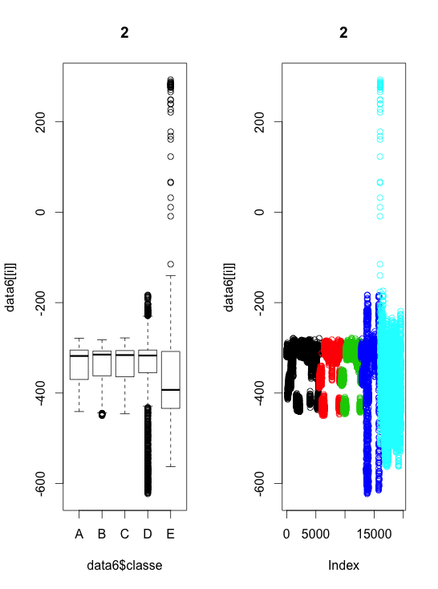
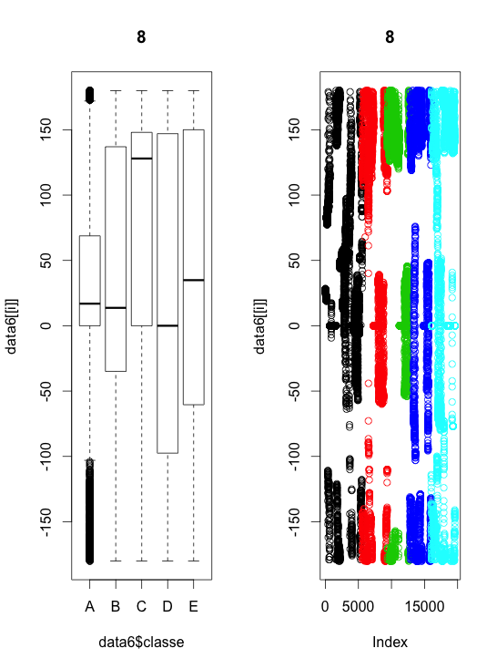

First of all, I load the required packages and read the data file and save it to a data.frame "data". When I read the data file I used the na.strings=c("NA","") option.

```{r}
library(ISLR)
library(caret)

data=read.csv("pml-training.csv",na.strings=c("NA",""))
dim(data)
```
The data.frame consist of 19622 observations of 160 variables. To reduce number of predictors, I removed the columns that contains NA value.
```{r}
data1 <- data[, which(as.numeric(colSums(is.na(data)))==0)]
dim(data1)
```
And then I reduced the 160 variables to 60 variables. And then I selected only the numeric variables. And then I removed correlated predictors with r value more than 0.8 and then more than 0.5.

```{r}
data2=data1[,7:60]
dim(data2)
M=abs(cor(data2[,-54]))
head(which(M>0.8,arr.ind=T))
data3=data2[,-c(4,5,10,11,9,12,19,25,26,29,30,32,47)]
M=abs(cor(data3[,-41]))
head(which(M>0.5,arr.ind=T))
data4=data3[,-c(2,3,4,6,7,10,12,14,15,16,17,19,20,21,22,25,35,36,40)]
M=abs(cor(data4[,-22]))
tail(which(M>0.5,arr.ind=T))
data5=data4[,-c(10,12)]
```

For further reducing variables, I performed exploratory analysis using bivariate plots, and removed 7 more variables. For example,
```{r}
plot(data5[[2]]~data5$classe,data=data5)
data6=data5[,-c(2,5,10,14,15,16,17)]
```
and I removed 7 more variables. And than I made another exploratory graphs and selected 7 variables as predictors
```{r,eval=FALSE}
par(mfrow=c(1,2))
for(i in 1:12) {
plot(data6[[3]]~data6$classe,main=as.character(i))
plot(data6[[3]],col=data6$classe,main=as.character(i))
}
par(mfrow=c(1,1))
}
```



I chose 2nd variable as possible predictor and I removed the 8th variable.
Final data file consist of 7 variables as predictors.
```{r}
data7=data6[,c(1,2,4,5,7,9,11,13)]
```
And then I split the data file into training data and testing data
```{r}
InTrain<-createDataPartition(y=data7$classe,p=0.7,list=FALSE)
training<-data7[InTrain,]
testing<-data7[-InTrain,]
dim(training);dim(testing)
```
And I used the random forest method as a machine learning model with 25 repetitions(bootstrapped).
```{r,cache=TRUE}
modFit<-train(classe~.,data=training,method="rf")
modFit
```
The final model selected showed 100% accuracy. I tested my final model to predict classe with testing data.
```{r}
pred<-predict(modFit,testing)
table(pred,testing$classe)
```
